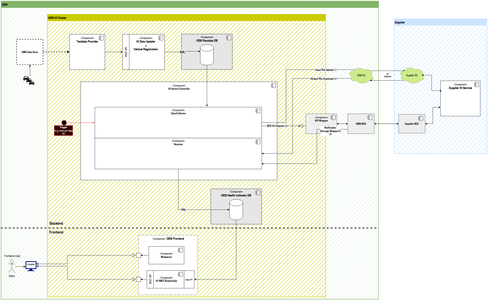

# OEM Health Indicator Application Overview

This service provides a periodic calculation of health indicators that can be visualized by a simple web frontend.

**Backend**
  * Collects daily updated load collectives and adaption values form a set of predefined vehicles.
  * Creates a input file for the external hi calculation service.
  * Triggers the hi calculation service at supplier side (using S3 dataplane for sending the input file).
  * Waits for the notification "hi calculation finished".
  * Writes the results to the frontend database.

**Frontend**
  * Provides a webserver to provide a simple dashboard (single page web application).
  * Retrives data from the frontend database.
  * Provides a REST API with an endpoint to fetch data to the dashboad.

**Building blocks:**

# Structural Areas

## OEM
The OEM area contains all Services that are hosted and maintained by the OEM. They can be part of the OEM's intranet or some cloud environment.

## OEM HI Cluster
The HI Cluster resides within the OEM area and contains all the services that are developed and/or exclusively used by the HI Service at OEM's responsibility.

## Backend
The backend includes Services to:
 * register vehicles to the service
 * update data
 * call the supplier service(s)
 * provide the health indicators to the frontend

## Frontend
The frontend provides a user interface to display and inspect the precalculated health indicators on demand.
 
---
--- 

# OEM HI Cluster

## Testdata Provider (Backend)
This service provides the Testdata. The data source is implementation specific. It can be some locally hosted JSON files or an AAS interface and so on.

At the initialization phase, this service registers all vehicles at the Vehicle Registration via REST API. The AAS id relation between the vehicle and its gearbox must be part of the registration.

If there are new Data or vehicles available, this service calls the HI Data Updater (via REST API) with the updates.

In a real-world scenario, the data may be pushed directly by the vehicles over the air.

## HI Data Updater + Vehicle Registration (Backend)
This service provides a REST API to register new vehicles and update data like load collectives and adaption values. This happens whenever new data are pushed by the Testdata Provider. The data are written to the OEM Rawdata database.

## OEM Rawdata DB (Backend)
This database is used to store the vehicle objects with their gearbox relations as well as the load collectives and the adaption values. The content of this database could be exposed as AAS assets if necessary.

## HI Service Controller (Backend)
The HI Service Controller is called periodically, e.g., once per day. It could also be triggered manually. It is responsible to manage the health indicator calculation that is hosted at the supplier. Therefore, there are two modules. The Data Collector collects the current input data and sends it to the supplier service. The Receiver waits until the calculation is finished and then downloads the results and stores them into a database.

### Data Collector
This module read all current data from the OEM Rawdata database and builds up a JSON file with this data. This file acts as input for the Supplier HI Service.

Afterwards, the file is stored in the OEM S3 bucket, and the Supplier HI Service is called via EDC with S3 data plane. So now the supplier can download the file and run the health indicator service.

### Receiver
This module waits until the Supplier HI Service is finished. This will be indicated by an EDC notification. As soon as the notification arrives, the results are downloaded from the OEM S3 bucket. Now, the data are associated with the corresponding vehicles in the OEM Health Indicator DB (or created if a vehicle don’t exist in this database yet).

## OEM Health Indicator DB (Backend)
In this database, all health indicator values are stored. They can be prompted by the OEM Frontend on demand.

The content of this database could be exposed as AAS assets if necessary.

## OEM Frontend
The OEM Frontend is independent of the OEM Backend. The only Interface is the OEM Health Indicator DB. There can be newer data in the OEM Rawdata DB, but the frontend only can access the latest precalculated health indicators in the OEM Health Indicator DB, which are updated periodically.

### Webserver
The Webserver provides the Frontend without health indicator data.

### HI REST Endpoint(s)
The REST API provides the health indicator data, that are dynamically loaded by the HTML page that is displayed at the user's browser. The data source is the OEM Health Indicator DB.

There are endpoints that can create statistics and correlations without transferring the whole datasets to the user.
 
---
--- 

# General OEM components

## API Wrapper (Backend)
The API Wrapper is a general service that provides an easy-to-use interface to the EDC.

## OEM EDC
The EDC standard component to communicate between OEM and supplier.

## OEM S3
The OEM S3 bucket is hosted by the OEM. It is used to transfer data between OEM and supplier via the EDC data plane.

## OEM Data Store
The OEM Data Store is a placeholder. In the actual implementation of the HI POC, this component can be omitted. The data can be included into the Testdata Provider service.

In a real-world scenario, there are several possibilities:
 * The vehicle data are directly pushed over the air to the Testdata Provider.
 * The Data Store is a database service where the vehicle data are pushed to.
 * There is a combined service that pushes the vehicle data directly to the OEM Rawdata DB.